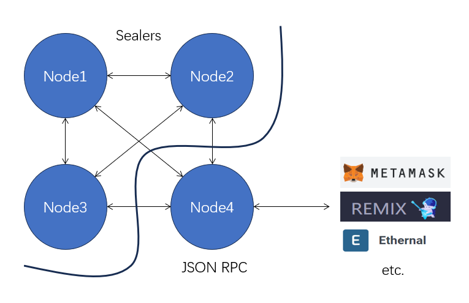
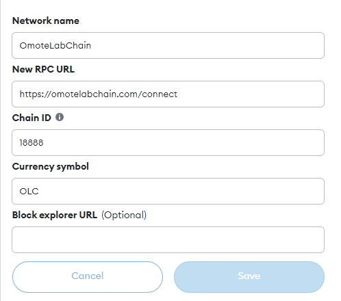
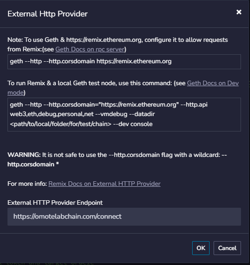
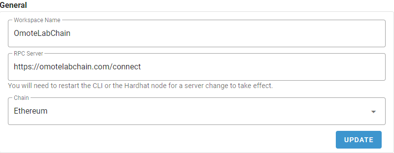

# Private PoA Blockchain tutorial

## 1. Purpose

To build a PoA private chain with four nodes, the first three nodes are the sealers of the blocks and the last node realizes the communication with the outside.

The nodes are created on a Google virtual instance using Geth and the consensus algorithm is Clique.

- node1 **Sealer**
- node2 **Sealer**
- node3 **Sealer**
- node4 **JSON-RPC**

The structure is shown below




## 2.Creating a Virtual Machine Instance（Google Computer Engine）

```
Name：omotelab-blockchain-node-1
Region：us-central1
Series: E2
Machine type: e2-medium (2 vCPU, 1 core, 4 GB memory)
Availability policies: Standard
Size: 40 GB
License type: Free
Image: Ubuntu 20.04 LTS
Firewall: Allow HTTP traffic, Allow HTTPS traffic, Allow Load Balancer Health Checks
```

Reference ：https://zhuanlan.zhihu.com/p/40983101?edition=yidianzixun&utm_source=yidianzixun

## 3. Create private blockchain node

#### 3.1. install go

Download the Go installer

```
wget https://go.dev/dl/go1.21.4.linux-amd64.tar.gz
```

Unzip the Go installer

```
sudo tar -C /usr/local -xzf go1.21.4.linux-amd64.tar.gz
```

Configuring Environment Variables

```
export PATH=$PATH:/usr/local/go/bin
```

Verify go

```
go version
```

#### 3.2.Install the geth client

```
sudo add-apt-repository -y ppa:ethereum/ethereum 
sudo apt-get update 
sudo apt-get install ethereum
```

#### 3.3. create node

**Taking node1 as an example**

Create a folder for node1 on virtual instance 1

```
mkdir node1
```

Create a new account

```
geth --datadir node1 account new 
```

Repeat on the other VMs for the three addresses obtained

```
node1:0xe05243c3601a51450D5BbEBC7783D08A6397A228 
node2:0x60755f401aeb8ca7A7C08039796cadA0723d7eBc 
node3:0x3b9BDCB4403f6f268CE70650A1CBB6FaCafF135b
password1:your-password1
password2:your-password2
password3:your-password3
```

Create and configure the genesis.json file as follows

```
{
  "config": {
    "chainId": 18888,
    "homesteadBlock": 0,
    "eip150Block": 0,
    "eip155Block": 0,
    "eip158Block": 0,
    "byzantiumBlock": 0,
    "constantinopleBlock": 0,
    "petersburgBlock": 0,
    "clique": {
      "period": 30,
      "epoch": 30000
    }
  },
  "difficulty": "1",
  "gasLimit": "8000000",
  "extradata":"0x0000000000000000000000000000000000000000000000000000000000000000e05243c3601a51450D5BbEBC7783D08A6397A22860755f401aeb8ca7A7C08039796cadA0723d7eBc3b9BDCB4403f6f268CE70650A1CBB6FaCafF135b0000000000000000000000000000000000000000000000000000000000000000000000000000000000000000000000000000000000000000000000000000000000",
  "alloc": {
    "0xe05243c3601a51450D5BbEBC7783D08A6397A228": { "balance": "300000000000000000000000000000000"},
    "0x60755f401aeb8ca7A7C08039796cadA0723d7eBc": { "balance": "300000000000000000000000000000000"},
    "0x3b9BDCB4403f6f268CE70650A1CBB6FaCafF135b": { "balance": "300000000000000000000000000000000"}
  }
}
```

Initialize node

```
geth init --datadir node1 genesis.json
```

Test (to verify that the password is correct)

```
geth --datadir node1 --unlock "0xe05243c3601a51450D5BbEBC7783D08A6397A228" console
```

Testing (balance inquiries and transfers)

```
eth.getBalance(eth.accounts[0]) 
eth.sendTransaction({  to: '0x1Fa1520A45d5A28f2487D15915f8FF27FA538545',  from: eth.accounts[0],  value: 5000000000000000000 });
```

## 4. Install and configure clef

> clef is a separate key management tool from geth, the personal package for account management has been removed from geth in a recent update.

#### 4.1. initialize clef

```
clef --keystore ./node1/keystore --configdir ./clef --chainid 18888 --suppress-bootwarn init
```

Enter your clef password during the above process

```
password：your-clef-password
```

Save node1 password to clef

```
clef --keystore ./node1/keystore --configdir ./clef --chainid 18888 --suppress-bootwarn setpw 0xe05243c3601a51450D5BbEBC7783D08A6397A228
```

Test (enter clef console)

```
clef --keystore ./node1/keystore --configdir ./clef --chainid 18888 --suppress-bootwarn --nousb
```

Test(launching the blockchain in a new terminal )

```
geth  --datadir ./node1 --signer ./clef/clef.ipc console
```

Test (balance inquiries and transfers in the new terminal, authorization in the previous clef terminal)

```
eth.getBalance(eth.accounts[0]) 
eth.sendTransaction({  to: '0x1Fa1520A45d5A28f2487D15915f8FF27FA538545',  from: eth.accounts[0],  value: 5000000000000000000 });
```

#### 4.2. Create rules to automatically seal blocks

Create a file called rules.js

```
function OnSignerStartup(info) {}

function ApproveListing() { 
 console.log('In Approve Listing'); 
 return 'Approve'; 
} 

function ApproveSignData(r) {
  if (r.content_type == 'application/x-clique-header') {
    for (var i = 0; i < r.messages.length; i++) {
      var msg = r.messages[i];
      if (msg.name == 'Clique header' && msg.type == 'clique') {
        console.log('In Approve SignData'); 
        return 'Approve';
      }
    }
  }
  return 'Reject';
}

function OnApprovedTx(r) {
 console.log('In Approve Transcation'); 
 return 'Approve'; 
}
```

Update rules

```
clef --keystore ./node1/keystore --configdir ./clef --chainid 18888 --suppress-bootwarn  attest  `sha256sum rules.js | cut -f1`
```

Test (into clef console with rules)

```
clef --keystore ./node1/keystore --configdir ./clef --chainid 18888  --suppress-bootwarn  --rules ./rules.js --nousb
```

Test (launch the blockchain in a new terminal )

```
geth  --datadir ./node1 --signer ./clef/clef.ipc console
```

Test (balance inquiries and transfers in a new terminal, clef automatically seal blocks, but transfer operations still require authorization)

```
eth.getBalance(eth.accounts[0]) 
eth.sendTransaction({  to: '0x1Fa1520A45d5A28f2487D15915f8FF27FA538545',  from: eth.accounts[0],  value: 5000000000000000000 });
```

## 5. Open ports for testing

**Before performing this step you need to open ports 30303,8545 in the cloud server**.

Reference ：https://zhuanlan.zhihu.com/p/40983101?edition=yidianzixun&utm_source=yidianzixun

#### 5.1. Starting three nodes

```go
geth --datadir ./node1 --signer ./clef/clef.ipc  --http --http.corsdomain "*"  --http.vhosts "*" --http.addr 0.0.0.0 --http.port 8545 --mine --miner.etherbase=0xe05243c3601a51450D5BbEBC7783D08A6397A228
```

```go
geth --datadir ./node2 --signer ./clef/clef.ipc  --http --http.corsdomain "*"  --http.vhosts "*" --http.addr 0.0.0.0 --http.port 8545 --mine --miner.etherbase=0x60755f401aeb8ca7A7C08039796cadA0723d7eBc
```

```go
geth --datadir ./node3 --signer ./clef/clef.ipc  --http --http.corsdomain "*"  --http.vhosts "*" --http.addr 0.0.0.0 --http.port 8545 --mine --miner.etherbase=0x3b9BDCB4403f6f268CE70650A1CBB6FaCafF135b
```

#### 5.2. Adding Peer Nodes

> In public Ethernet networks, there are dedicated bootnodes to help nodes discover other nodes. However, in private chains, due to the smaller size of the network, there are no broadcast nodes like in public networks. Therefore, manually adding peer nodes is a way to ensure that nodes can discover and connect to each other.

Add peer node2,3 to node1

```
admin.addPeer("enode://567332307ea1080f6c50a2bb9fa51827452cf04d22d8a7ea857ed59ebe4808a7d34f25c5ab5de13a48f85b822bf24faaa1acaa6bd29c886ca1d5cbf119a441d7@your-ip-address:30303")
```

```
admin.addPeer("enode://395d31cc68457375bcc492d9932f301733a7d28d8f81f3f7a2274d33b116ce9a866981cfb64d6190c25eddcd8321322521e653737223fadc0559b66cbc6aeb66@your-ip-address:30303")
```

Add peer node3 to node2

```
admin.addPeer("enode://395d31cc68457375bcc492d9932f301733a7d28d8f81f3f7a2274d33b116ce9a866981cfb64d6190c25eddcd8321322521e653737223fadc0559b66cbc6aeb66@your-ip-address:30303")
```

Don't forget to test.

```
admin.peers
```

## 6. SSLization

> Metamask can add networks under the http protocol
>
> Find **Networks \> Add a network** in Metamask.
>
> Fill in the **New RPC URL** with http://your-ip-address:8545
>
>
> Enter 18888 in the **Chain ID**.
>
> But Remix and Ethernal need https protocol to communicate.

#### 6.1. Domain name registration and DNS configuration

The domain name registered in this article is as follows, the specific configuration method can refer to the following information

```
omotelabchain.com
```

Reference ：https://cloud.google.com/dns/docs/tutorials/create-domain-tutorial?_ga=2.210337045.-1611711750.1700539884&_gac=1.195723870.1701005349.CjwKCAiA9ourBhAVEiwA3L5RFmwJ20O5cl2vgjs6BrKhMZWnyRoOVO4h4sijXr3Ss5cN7FIXB8FZZBoCzpAQAvD_BwE

#### 6.2. Creating a JSON-RPC node

Create a node4 on virtual instance 4, without going into details.

```
node4:0xC1787136675d47f78C0cf7F55E984D1Ed2486399
password4：your-password-4
```

Starting a JSON-RPC Node

```
geth --datadir ./node4 --signer ./clef/clef.ipc  --http --http.corsdomain "*"  --http.vhosts "*" --http.addr 0.0.0.0 --http.port 8545 --networkid 1
```

**Don't forget to add the peer node (networkid needs to be the same, otherwise it won't be added)**.

#### 6.3. Install Nginx and configure the certificate.

Install Nginx on virtual instance 4

```
sudo apt install nginx
```

Installing Certbot

```
sudo apt install certbot python3-certbot-nginx
```

Obtaining Certificates

```
sudo certbot --nginx -d your-domain.com
```

The certificate is saved in the

```
ssl_certificate /etc/letsencrypt/live/your_cert/fullchain.pem;
ssl_certificate_key /etc/letsencrypt/live/your_cert/privkey.pem;
```

#### 6.4. Configuring Nginx Certificates and Proxy Forwarding

Open the Nginx configuration file

```
vim /etc/nginx/nginx.conf
```

Add the following configuration

1. listen on port 443 and add the certificate
2. Forward traffic from your-domain.com/connect to local port 8545 (JSON-RPC)

```
server {
    listen 443 ssl;
    server_name your-domain.com;

    ssl_certificate /etc/letsencrypt/live/your-cert/fullchain.pem;
    ssl_certificate_key /etc/letsencrypt/live/your-cert/privkey.pem;

    ssl_protocols TLSv1.2 TLSv1.3;
    ssl_ciphers 'TLS_AES_128_GCM_SHA256:TLS_AES_256_GCM_SHA384:TLS_CHACHA20_POLY1305_SHA256:ECDHE-RSA-AES128-GCM-SHA256:ECDHE-RSA-AES256-GCM-SHA384';

    location / {
        root /usr/share/nginx/html;
        index index.html;
    }

    location /connect {
        proxy_pass http://127.0.0.1:8545/;
    }
}
```

Load the configuration and start nginx

```
systemctl reload nginx
systemctl start nginx
```

## 7. Configuring the application

#### 7.1.MetaMask



#### 7.2.Remix



Although it is possible to connect to node4 through the External Http Provider environment described above, it is only possible to deploy smart contracts using an account on node4, which means that transactions require the administrator to authorize each transaction in the Clef tool, making it very inconvenient. It is recommended to use Injected Provider - Metamask to connect and deploy smart contracts using your own account.

#### 7.3.Ethernal



When creating a new account and configuring it as above, it will only synchronize from the newest node and will lose synchronization when closing the browser. To avoid this, you need to create a node in a client to access the blockchain and run the Ethernal client at the same time to synchronize.

In this paper, we run the Ethernal client in node4 for synchronization.

Reference: https://github.com/tryethernal/ethernal-cli

## 8.Monitoring dashBoards

In order to monitor the performance of node1, you can install the monitoring panel, the procedure is as follows

Reference: https://geth.ethereum.org/docs/monitoring/dashboards

## 9. Appendix

#### startup settings

1. **--verbosity 5** can bring up the highest level of logging
2. **2>>output.log** Print logs to output.log for easy viewing. 3. **--nodiscover** Private chains do not usually need internet discovery.
3. **--nodiscover** Private chains generally don't need to discover nodes in the Internet.

```
geth --datadir node4 --http --http.api web3,eth,net --http.corsdomain "*" --http.addr 0.0.0.0 --http.port 8545 --nodiscover --verbosity 5 2>>output.log
```

#### Problems I've encountered

https://stackoverflow.com/questions/77544342/unable-to-connect-to-the-test-node-by-using-external-http-provider-in-remix

https://learnblockchain.cn/question/5281

#### Chinese version

https://xuanyuangoudan.cyou/2023/11/27/poachain%e5%ad%a6%e4%b9%a0%e7%ac%94%e8%ae%b0part-3/

#### Follow-up

1. security check
2. Add new wrapper node

